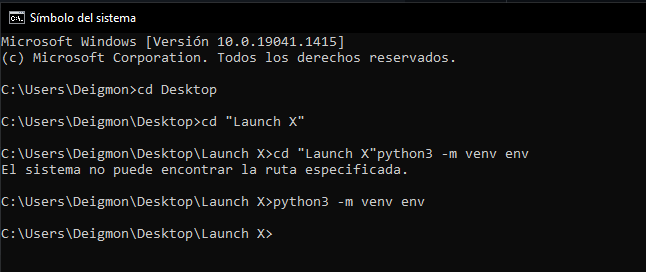
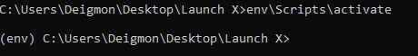

# Crear un entorno virtual

## Creación de entorno virtual en WSL2

* Ejecutar en terminal: ``python3 -m venv env``

  ```
     python3 -m venv env 
  ```



## Activar entorno

* Ejecutar en terminal ``source env/bin/activate``

  ```
     env\Scripts\activate 
  ```



## Desactivar entorno

* Ejecutar en terminal ``deactivate``

  ```
     deactivate 
  ```


## Instalar una biblioteca

* Con el entorno activado ejecutamos en la terminal ``pip install python-dateutil``

  ```
     pip install python-dateutil
  ```


* Un mensaje de salida dice que está instalando correctamente, y termina con la siguiente oración:

  ```
  Successfully installed python-dateutil-2.8.2 six-1.16.0
  ```

